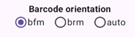

# ITROBOC Grid13 `bfm` / `brm` Orientation and Sentinel Design

## Status

This document records the current working design for the `grid13-v1` barcode signature model used by ITROBOC.

The central point is:

> `bfmHHHH` and `brmHHHH` are both valid raw-signature families, but they are orientation-bearing tokens. They must not be canonicalized into one unlabeled identity.

Internally, the nicknames are:

- `bfm` = beetle forward meal
- `brm` = beetle reverse meal

The names are intentionally compact for UI alias chips and profile files. The joke may be mentioned in docs, but the important technical fact is that the prefix is part of the raw signature identity.

## Context

ITROBOC reads barcode-like marks printed on physical playing cards. The scanner should output a raw signature. A Deck Profile maps raw signatures to semantic bridge cards such as `SA`, `DQ`, or `C7`.

The scanner must not directly know card meaning. Card meaning belongs to Deck Profiles.

The current working model is `grid13-v1`:

1. Locate the barcode strip.
2. Collapse the crop into a 1D ink signal.
3. Detect the active barcode span from the first black boundary to the last black boundary.
4. Divide the active span into 13 cells.
5. Threshold the 13 cells into a 13-bit occupancy string.
6. Encode that 13-bit value into a compact raw signature.

Example:

```text
grid13 bits: 1001010100101
hex payload: 12A5
raw signature: bfm12A5
```

## Why not use long aliases?

Aliases are shown as clickable UI chips in Admin::Edit. They must remain short and readable.

Bad UI alias:

```text
grid13Fwd-1001010100101
```

Good UI alias:

```text
bfm12A5
```

Full details belong in debug logs, not in alias chips.

## Token format

Raw signatures under `grid13-v1` use:

```text
bfmHHHH
brmHHHH
```

Where:

- `bfm` means the forward orientation family.
- `brm` means the reverse orientation family.
- `HHHH` is exactly four uppercase hex digits.
- `HHHH` encodes the 13-bit Grid13 payload left-padded into a 16-bit integer.

The 13-bit visual string maps as:

```text
leftmost cell  -> bit12
rightmost cell -> bit0
```

The top three 16-bit padding bits are unused.

## Sentinel rule

A valid Grid13 barcode should visually have this outer structure:

```text
10.........01
```

That means:

- `bit12 = 1` — left boundary black cell
- `bit11 = 0` — white gap after the left boundary
- `bit1  = 0` — white gap before the right boundary
- `bit0  = 1` — right boundary black cell

As a numeric mask check:

```kotlin
(value and 0x1803) == 0x1001
```

Expanded:

```kotlin
(value and 0x1000) != 0 // bit12 must be 1
(value and 0x0800) == 0 // bit11 must be 0
(value and 0x0002) == 0 // bit1 must be 0
(value and 0x0001) != 0 // bit0 must be 1
```

This is both a mistake detector and a control-bit rule. When measurement
violates it, the four control cells are normalized to `10.........01` before
the signature is produced. The original bits and repair reason remain in debug
evidence.

`sentinelValid` describes the measured pre-normalization bits. Therefore it can
be `false` while the emitted signature contains the corrected control bits.

## Important: do not canonicalize orientation

Earlier research showed that canonicalizing forward/reverse signatures can create collisions.

Do not do this:

```text
canonical = min(forwardBits, reverseBits)
```

Do not silently treat these as equivalent:

```text
bfm1255
brm1255
```

The prefix is part of the identity.

## Physical interpretation of `bfm` / `brm`

A playing card has two meaningful ends: a normal corner and a 180-degree rotated opposite corner. In physical use, scanning the opposite end of the card can produce the reverse-orientation barcode.

Therefore `brm` is not merely disposable debug data. It may represent a real, useful physical scan channel.

The correct rule is:

> Preserve orientation explicitly. Never erase it.

## TD session orientation mode

The TD Board Scan screen exposes one session-wide orientation choice:

- `bfm` uses the decoder's forward `rawSignature`.
- `brm` uses the decoder's `reverseSignature`.
- `auto` is reserved for future orientation detection and must not guess yet.

The selection is owned by app-level session state, so it remains selected while
the user moves between boards. It does not survive application relaunch yet.

Current UI:



## Deck Profile policy

A Deck Profile may contain both `bfm...` and `brm...` aliases for a card, but only as explicit orientation-bearing raw signatures.

The profile must still enforce the core alias invariant:

> One raw signature maps to at most one CardId.

That means the full token string must be globally unique within a profile.

For example, these are distinct tokens:

```text
bfm1549
brm1549
```

But this is illegal:

```text
bfm1549 -> SA
bfm1549 -> DT
```

The profile builder should fail fast or return a conflict if this happens.

## Why this matters

Some real card pairs have criss-crossed orientation relationships.

For example, a card's forward payload can correspond to another card's reverse payload. That is expected and not a problem if prefixes are preserved.

The problem occurs only if orientation is erased or canonicalized.

Safe:

```text
Card A: bfmX / brmY
Card B: bfmY / brmX
```

Unsafe:

```text
canonical(X,Y) -> both cards
```

## Current observed-profile hygiene rules

When updating the built-in observed profile:

1. Every token must pass the Grid13 sentinel rule.
2. Every full token must be unique across the profile.
3. `bfm` / `brm` orientation should not be swapped casually.
4. If a previous table has a valid `bfmX / brmY` orientation and a generated table says `bfmY / brmX`, keep the previous orientation unless there is physical evidence to change it.
5. If a corrected row collides with an existing valid row, flip only the corrected row if that resolves the collision and preserves the full-token uniqueness invariant.
6. Keep `grid13-v1-golden.json` as evidence/reference, but do not assume it knows physical `bfm` versus `brm` orientation unless it records that source explicitly.

The built-in observed profile's orientation was subsequently checked visually
against the physical cards. That pass flipped the `bfm`/`brm` labels, without
changing payload pairs, for:

```text
H3 H4 H7 HQ SA S8 D3 D5 DT DJ C2
```

## Recommended debug fields

Debug logs should continue to include verbose evidence:

```text
rawSignature
reverseSignature
grid13FwdBits
grid13RevBits
grid13FwdHex
grid13RevHex
rl2
blackRunsPx
whiteGapsPx
activeSpanPx
confidence
warnings
sentinelCheck
sentinelRepairApplied
sentinelRepairReason
```

The UI alias chip should remain compact:

```text
bfm12A5
```

## Suggested tests

Add tests for:

1. Every observed built-in token passes the sentinel rule.
2. Every observed built-in token is globally unique.
3. `bfm` and `brm` prefixes are preserved as part of identity.
4. Reverse/canonical collapsing is not used for DeckProfile lookup.
5. Known criss-cross pairs remain distinct.
6. Decoder output failing the sentinel rule produces a `Found` result after intentional control-bit normalization, provided confidence remains high.
7. Any repair/snap behavior is documented and logged with warnings. Pre-normalization bits must be retained in debug evidence.

The current implementation normalizes the four control cells before producing
the signature. It records the pre-normalization bits, issues, and repair reason.
Confidence is checked afterward, so a corrected low-confidence measurement
still produces `Ambiguous`; a corrected sufficiently confident measurement can
produce `Found`.

## Design motto

> Visible runs are evidence; Grid13 cells are identity; `bfm/brm` prefixes preserve orientation.
